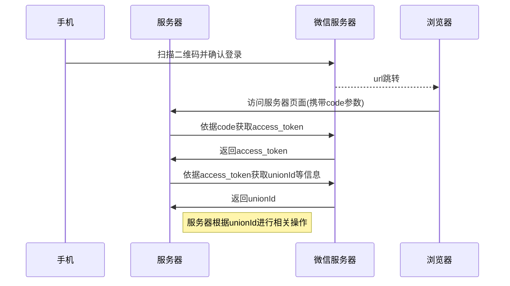

qq 微信快速登录开发文档
======
### 目录
[一. 微信](#1)
  - [1.1 微信登录实现过程流程图](#1)
  - [1.2 具体实现过程](#1.2)
  - [1.2.1 生成二维码](#1.2.1)
  - [1.2.2 获取access_token](#1.2.2)
  - [1.2.3 获取unionId等用户数据](#1.2.3)
  - [1.2.4 服务器根据unionId进行相关操作](#1.2.4)

[二. qq](#2)
- [2.1 生成登录页面](#2.1)
- [2.2 通过code获取token](#2.2)
- [2.3 根据accessToken获取用户信息](#2.3)
- [2.4 根据获取到的openid进行相关操作](#2.4)

-------

<span id="1"></span>
### 一.微信
<span id="1.1"></span>
#### 1.微信登录实现过程流程图

具体流程见[网站应用微信登录开发指南](https://open.weixin.qq.com/cgi-bin/showdocument?action=dir_list&t=resource/res_list&verify=1&id=open1419316505&token=9b2933f7ee2d51c465f310a1d41661d14dfc62d9&lang=zh_CN)
<span id="1.2"></span>
#### 2. 具体实现过程
<span id="1.2.1"></span>
  1. 生成二维码

二维码生成地址为https://open.weixin.qq.com/connect/qrconnect?appid=APPID&redirect_uri=REDIRECT_URI&response_type=code&scope=SCOPE&state=STATE#wechat_redirect
 替换相应的变量,其中redirect_uri为回调地址,即扫描二维码后跳转到的地址,需与***微信开放平台***配置的回调地址相同,本地测试时可配置为本地地址(_如localhost_)具体见官方文档
 <span id="1.2.2"></span>
  2. 获取access_token

服务器获取code后通过get请求https://api.weixin.qq.com/sns/oauth2/access_token?appid=APPID&secret=SECRET&code=CODE&grant_type=authorization_code
服务器返回数据如下格式:
```json
{
  "access_token":"ACCESS_TOKEN",
  "expires_in":7200,
  "refresh_token":"REFRESH_TOKEN",
  "openid":"OPENID",
  "scope":"SCOPE",
  "unionid": "o6_bmasdasdsad6_2sgVt7hMZOPfL"
}
```
数据映射到实体类中,具体实现代码如下:
```java
        //get access_token
        String getAccessTokenUrl = "https://api.weixin.qq.com/sns/oauth2/access_token?appid=" + appid + "&secret=" + secret + "&code=" + code + "&grant_type=authorization_code";
        String accessTokenResultString = new NetworkOperation().getMethod(getAccessTokenUrl);//获取数据
        //解析json数据
        Gson gson = new Gson();
        WxTokenBean accessTokenResultJson = gson.fromJson(accessTokenResultString, WxTokenBean.class);
        String accessToken = accessTokenResultJson.getAccess_token();
        String openid = accessTokenResultJson.getOpenid();

```
<span id="1.2.3"></span>
  3. 获取unionId等用户数据
  GET请求  https://api.weixin.qq.com/sns/oauth2/access_token?appid=APPID&secret=SECRET&code=CODE&grant_type=authorization_code
  实现代码如下:

```java
  //get user info
      String getUserInfoUrl = "https://api.weixin.qq.com/sns/userinfo?access_token=" + accessToken + "&openid=" + openid;
      String userInfoResult = new NetworkOperation().getMethod(getUserInfoUrl);
      return gson.fromJson(userInfoResult, WxUserInfoBean.class);
```
  服务器返回:
```json
{
  "openid":"OPENID",
  "nickname":"NICKNAME",
  "sex":1,
  "province":"PROVINCE",
  "city":"CITY",
  "country":"COUNTRY",
  "headimgurl": "http://wx.qlogo.cn/mmopen/g3MonUZtNHkdmzicIlibx6iaFqAc56vxLSUfpb6n5WKSYVY0ChQKkiaJSgQ1dZuTOgvLLrhJbERQQ4eMsv84eavHiaiceqxibJxCfHe/0",
  "privilege":[
    "PRIVILEGE1",
    "PRIVILEGE2"
  ],
  "unionid": " o6_bmasdasdsad6_2sgVt7hMZOPfL"
}
```
<span id="1.2.4"></span>
  4. 服务器根据unionId进行相关操作
### 二.qq
[qq互联管理地址](https://connect.qq.com/)
[qq互联开发文档](http://wiki.connect.qq.com/%E7%BD%91%E7%AB%99%E5%BA%94%E7%94%A8%E6%8E%A5%E5%85%A5%E6%B5%81%E7%A8%8B)

qq登录流程与微信登录流程类似,见[微信登录实现流程图](#wx)
<span id="2.1"></span>
1. 生成登录页面
  https://graph.qq.com/oauth2.0/authorize +参数
  redirect_uri为回调地址,与微信类似
  登录成功后会跳转到redirect_uri?code=9A5F************************06AF&state=test
  <span id="2.2"></span>
2. 通过code获取token
  根据返回的code请求https://graph.qq.com/oauth2.0/token
  返回格式如下:
```
access_token=97F56A2F10855247B41CCCD6453C7057&expires_in=7776000&refresh_token=D61381A12F49301CD1DE5939A6A976E0
```
access_token获取和解析代码如下:
```java
//get access_token
       String getAccessTokenUrl = "https://graph.qq.com/oauth2.0/token?grant_type=authorization_code&client_id=" + appid + "&client_secret=" + secret + "&code=" + code + "&redirect_uri=" + redirect_uri;
       String accessTokenResultString = new NetworkOperation().getMethod(getAccessTokenUrl);
       Matcher m = Pattern.compile("^access_token=(\\w+)&expires_in=(\\w+)&refresh_token=(\\w+)$").matcher(accessTokenResultString);
       String accessToken="";
       if (m.find()) {
           accessToken = m.group(1);
       } else {
           Matcher m2 = Pattern.compile("^access_token=(\\w+)&expires_in=(\\w+)$").matcher(accessTokenResultString);
           if (m2.find()) {
               accessToken = m2.group(1);
           }
       }
```
<span id="2.3"></span>
3. 根据accessToken获取用户信息

请求https://graph.qq.com/oauth2.0/me
返回数据格式:
```
callback( {"client_id":"YOUR_APPID","openid":"YOUR_OPENID"} );
```
获取和解析数据代码:
```java
String getUserInfoUrl = "https://graph.qq.com/oauth2.0/me?access_token="+accessToken;
        String userInfoResultString = new NetworkOperation().getMethod(getUserInfoUrl);
        Matcher m2 = Pattern.compile("\"openid\"\\s*:\\s*\"(\\w+)\"").matcher(userInfoResultString);
        String openid="";
        if(m2.find()) {
            openid = m2.group(1);
        }
        QqUserInfoBean qqUserInfoBean = new QqUserInfoBean();
        qqUserInfoBean.setOpenid(openid);
        return qqUserInfoBean;
```
<span id="2.4"></span>
4. 根据获取到的openid进行相关操作
